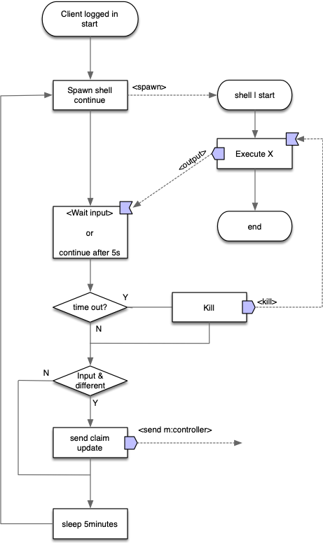
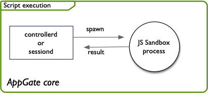
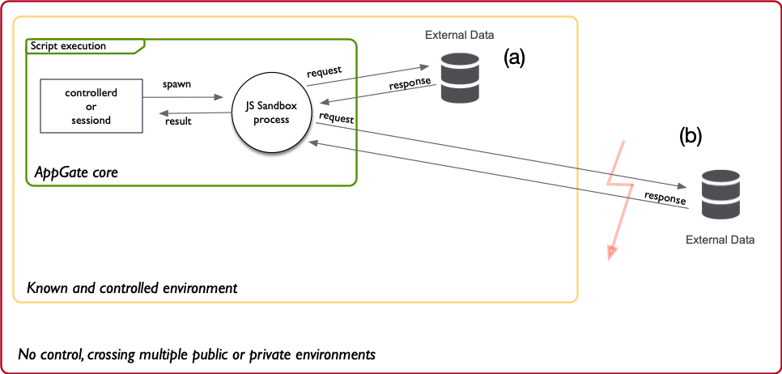
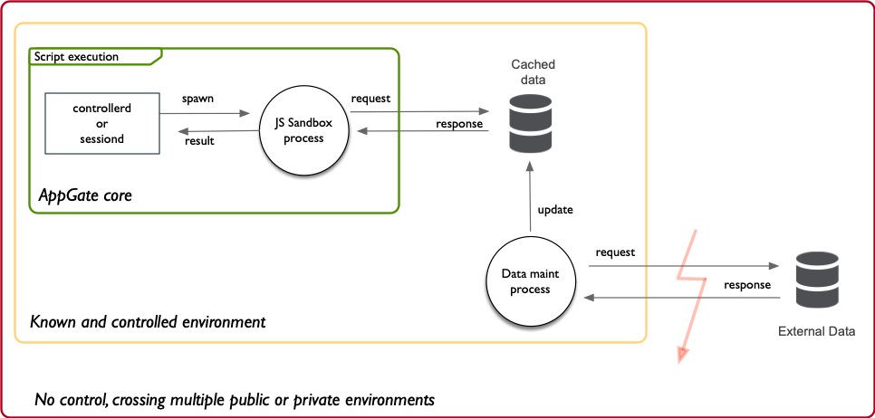

# TL;DR
## Current repositories with use-cases and example code

* [Entitlement Script: RDP host from AD](https://github.com/appgate/sdp-rdphosts)
* [Client: Windows security products checks Windows Security Center](https://github.com/appgate/sdp-win-security-center)
* [Client: Windows posture checks with WMIC](https://github.com/appgate/sdp-wmicprovider)
* [Client: Locality based posture check](https://github.com/appgate/sdp-locality-check)

## List of provided tools 
The following table summarises tools and scripts which can be found, and are used, throughout the AppGate SDP GitHub.

| Name             | Platform                                       | Info                                                                                                                                                       |
|------------------|------------------------------------------------|------------------------------------------------------------------------------------------------------------------------------------------------------------|
| agwscapi.exe     | `Windows` `8` `10`, `x86_64`                   | [Windows security center query, anti virus, anti spyware and firewall](https://github.com/appgate/sdp-wscapi).                                             |
| devicecheck.exe  | `Windows` `8` `10`, `i386`                     | [Some windows related checks plus some special actions](https://github.com/appgate/sdp-windows-check). It originates from AppGate Classic aka `check.exe`. |
| wmicprovider.exe | `Windows` `8` `10`, `x86_64`                   | [On-Demand Device Scripting with the Windows Management Instrumentation Command-line (WMIC) Utility](https://github.com/appgate/sdp-wmicprovider).         |
| detector         | `Windows` `8` `10`, `linux`, `macOS`, `x86_64` | [Verify if a client machine is close to a trusted, isolated TLS server](https://github.com/appgate/sdp-locality-check).                                    |
| chkmos           | `macOS`, `x86_64`                              | [MacOS related checks and information gathering](https://github.com/appgate/sdp-macos-check)                                                                                                             |

# Concepts
Conceptually we divide the  different integration points in AppGate in three categories:
1.	System Architects and business process system owners can model the user access provisioning process into an automated secure business process.
2.	Security officers and admins can rollout and enforce policy compliancy by modelling the policy rules.
3.	SOC and configuration-management can integrate with their company strategies and system to support compliant operations and react automatically on alerts and changes.

To meet these three conceptual challenges in IT secure access provisioning we added the integration points in AppGate SDP. You will find the integrations point in first an architectural overview and then with real world examples.

## Architecture

## AppGate SDP
The AppGate system builds on the _core system_ (AppGate SDP)which is the standard off the shelf product. The core system does convey all the features for a full SDP solution. The layer right above the core system,the middle layer, are higher level components but essentially belongs to the core system as well. The middle layer demonstrates the extension components exposed in the system, which are used for integrations or process workflows with other systems or sources.

## JavaScript Sandbox
The _Sandbox_ component is the in-system evaluation environment and sealed from the outside of the AppGate system. The sandbox evaluates JavaScript code. Entitlement scripts and criteria scripts can be either of the latter’s.  Note that the Java Script code however can be written to make use of external information through https requests etc.

## Name resolvers
_Name resolvers_ evaluate an expression as defined to the syntax accordingly to the type of VM fabric, or simple as to the DNS hostname. Name resolvers can be seen as higher level name resolvers to IP address, such as tags in a cloud environment.

## AppGate API
The _AppGate API_ ties in the core of the system. All the real configuration and operations is executed through the API. For example, the AppGate web-based admin user interface is using the API to read and write all the information and changes the administrators sees and makes.

## AppGate Client
The _AppGate Client_ allows the execution of a program or script on the host device. The execution is done in a shell of the operating system and is normally used to collect information from the host device aka un-trusted claims. These _device claims_ will be used for contextual decision making throughout the life-cycle of a user session.

# Shared Responsibilities 
The extensions can be separated into three areas where they are implemented or active:
* Client side
* Server side: 
  * Controller
  * Gateway
Controller and Gateway can be referenced as `server side` or `appliance side`. The figure below depicts the high-level view for extensions.

The colouring of the layered architecture model designates the level of responsibility:
* Green: all covered by AppGate SLA
* Yellow (risk exist): partially covered by AppGate SLA
* Red (high risk): partially covered by AppGate SLA

*Partially covered* means that AppGate provides the means in form of technology. However, the customer's use implementation and architecture in relation to it must be guaranteed by the customer and does not fall under SLA/support.

## Green (standard): Overall Core System
All the components involved in the configuration are standard and do not expose an operational risk if it is configured without more than standard settings.

## Yellow (Advanced): Extension might produce system impact or use issues
The components are advanced features and need to be properly designed, engineered and maintained through the system reliability team. The risk might be system performance degradation or end-user issues.

## Red (Advanced): Extension is critical for the overall uptime of the system
The components are system administration components and rely under the ownership of the system owner (accountability). The DevOps team and system reliability team are responsible for the proper usage and maintenance of the implemented extensions.

# Technical Background

## Internal anatomy and object model

### Claims, logic and external data
The extension model builds on the same principles as the built-in for policy assignment and conditions. There are two principles:
* Claims
* Logic

Claims are attributes from different contexts. Some are static, some are dependent on other components like the Identity Provider (mapped) and some can be created, such as with device scripts. A logic is an expression which allows to implement business rules by means of JavaScript code. 

For example assigning the policy `sales-team` to a user if the user's claim `group_membership` contains the value `sales`. That logic is implemented in a JavaScript using the necessary `claims`.

Now the part of which is called extensions in regards of those 2 principles are:
* Creating custom claims
* Get external data, to either use in decision making or in entitlement scripts (IPs, resolvable host identifiers).
* Creating custom logic (JS code)

## Dynamic model
The following sequence diagram depicts a user session with focus on the extensions, e.g when and where they are executed.

1. Client authenticates user on Controller.
1. Controller ships claims token to Client, device scripts are downloaded if needed.
1. Any device scripts are now executed if existing.
1. Any device claims tokens are send to Controller if generated by device script.
1. Client asks Controller for authorization.
1. Controller evaluates policies (policy assignment), runs scripts if defined.
1. Controller ships entitlement tokens to client.
1. Client finds from entitlement tokens Gateway addresses, and connects to these (one or many sites). Client sends all corresponding claims and entitlement tokens to its respective site.
1. Gateway(s) instantiate entitlements, runs entitlement scripts if any and resolves host names to IPs.

Whenever permitted traffic hits one of the firewall rules which has a condition attached, it will be evaluated every time until the condition returns true. A defined remedy action might trigger user end-user feedback as long the condition returns false. This can included MFA input, input field, password request etc. Good to know is that a remedy is only triggered when the condition fails. Also, a condition might have a re-evaluation timer which executes every `Z`minutes. Condition are also evaluated whenever entitlement tokens are renewed (by it's lifetime or forced via API call).

## Default timers
* Device scripts: every 5 minutes. 
* Entitlement scripts: 
  * Token re-newel or session re-newel.
* Policy assignment:
  * Criteria scripts; token or session re-newel.
* Entitlement conditions: 
  * When first traffic hits, 
  * when token is re-renewed and traffic hits, 
  * according to re-evaluation setting in the Entitlement. A re-evaluate session will also trigger the condition to be re-run.

## Token re-newel and session re-evaluation
Tokens  and session tokens are created or renewed when:
* Client authenticates and authorizes itself (login).
* When tokens are about to expire, client renews (see setting on your system of token life-time).
* When a condition has a re-evaluation timer set (see entitlement condition setting).
* When a device claim is reporting an update of the claim value, initiates a token re-newel.
* When API call is explicitly called for session or token re-newel.

### Revoking token with API call `/token-records/revoked/by-dn/{distinguished-name}`
Token renewal will revoke all tokens for a session and force the client to create new tokens. The *delayMinutes* property will allow the client to gracefully re-new the token without the user loosing connection to the end-points. When this is set to “0”, the gateway will immediately revoke all access because the tokens are revoked and client needs to go through the token creation motion first before instantiating the new entitlements tokens (remember all tokens are bound to validity time period).
With a delay of “n” minutes, new tokens have already been crated and the current tokens will be invalidated by `now` +n minutes. The user will be prompted basically immediately for authentication (if SAML), and once granted tokens are replaced. Default is 5 minutes.

### Re-evaluate session with API call `/token-records/reeval/by-dn/{distinguished-name}`
Reevaluate does force the _entitlement scripts_ and _conditions_ to be re-evaluated. This is less expensive and more robust than token-revocation method if you need only to force a conditions or entitlement scripts to be re-run than token renewal.

# The client side extension
The client side extension allows the AppGate System to collect information from the client device itself, called device claims. It is normally achieved through an executable script or program run by the client on the operating system of the client-device. The feature to achieve this is called [on demand device claims](https://sdphelp.appgate.com/adminguide/device-claims.html).

The information collected will be added to the set of claims for the user-session in the AppGate System, which can be utilized in decision making throughout the system.

An example of a use-case is for example a script which retrieves the system’s ID from the registry. The collected claims are typically consumed in decision making processes such as criteria for policy matching on the Controller or in criteria for conditions on the Gateways.

## Designing logic with client side extension
The on demand device claim is collected on the client. The client executes the specified resource which can be a script or binary (executable) on the operating system the client runs on.
> Note: device claims are regarded as the claim with the least trust. The source is the end-users machine, which could be compromised, or has a malicious user to manipulate the data provisioning in any form. This must be taken care by other means such as end-point protection, encryption, integrity check, secrecy or other means.

### Process flow
The flow diagram focuses on the device script execution only. The execution of the task `X` by the device which can be an artifact of the type: command, script or executable binary.

1. Client is successfully logged in.
1. A new process creates a shell and the task X is executed.
1. If task execution does not finishes before the 5 second time-out, client kills the process.
1. If we received an output of the task, it compares it to the output of the previous run:
	1. They are different: Client sends the new value upstream and the controller starts a token renewal to propagate the claim.
	1. They are not different: do nothing more.
1. Wait 5 minutes (default timer) before restarting at point 2. 

### Dual-value logic
To model properly a logic around the given use case, you will need to be able to consume the collected information on the appliance side, for example in a JavaScript expression on a condition.
Let's say you are reading a value from a Windows Registry Key, and compared it to a value provided in a user claim from LDAP. To be able to make a decision in the logic (a JavaScript expression), the logic needs to have the device claim (the value to be tested) and another claim/value (the value for the test to succeed). We call this a dual-value test.

You might end up with this method because:
* The value/data is complex, and maintaining the logic in the JS expression is easier than in the script.
* The value/data needs to be compared to another value.
  * Needs maintenance: If its a static value which does not or very seldom change.
  * No maintenance allowed or value changes often: Get that value from a local cache or a user.claim. If an external source is required be very careful and reconsider if this is the right choice.

### Self contained value logic
Self-contained values e.g where the value captures the semantics by its value (like yes/no or true/false) is the easiest method, since you do not need to maintain or provide a comparing value as additional data. This method should be used whenever there is low-risk and low impact for the source data. The logic is basically around the responsibility the value the script provides is reliable.

You might end up with this method because:
* Decision making is trivial, and all possible values are known, like `yes|no`
* The logic must reside on the client-side, and you have justified/managed and accounted for the cost/risk it might bring.
  * You can have different level of security whereas such a solution could be acceptable in the right level.

## Considerations with client side extension

### 1. The nature of the device script output
The device script runs by default every 5 minutes. If the output of the script changes compared to the previous run, it will update the device claim and in turn will instantiate a token re-newel process. Token re-newel is expensive and might impact performance in a scale environment of thousand of users.

Assure the device script's output does change only if absolute necessary. Basically it shouldn't change unless a policy has failed.

* Client side extensions are suited for use-cases where it can be expected the state of detection can have a big latency, meaning from a few hours upwards. Example: antivirus is updated.
* Client extensions should not be used as policy enforcing, rather as compliance checker.
* Make sure device script output is as deterministic and static as possible:
  * Limit the possibilities of output text.
  * Example for a minimal is the triple: `true|false|error`

### 2. Execution time-out
by default the client spawns a shell wherein the resource is executed. If the execution does not end after 5 seconds, the client will kill the process and continues. The reason for this is to keep a good user experience, and timing is important for this. The value of the time-out can be changed on the user's machine, but should be taken into consideration for the user experience (countermeasures need to be evaluated).

### 3. Execution rights (OS)
Some operating system have restrictions controlled by the local or remote (domain) policy. In case of Windows please check with your domain administrator/security team what changes to do (policy change, signing etc.).

### 4. Endpoint protection and white-listing
If an endpoint protection or white listing software is installed you might need to adjust the policies of those to guarantee execution of them. You can provide the script to the operations and security team to review the scripts and the checksum of it (as displayed in the AppGate console).

### 5. Privileges
The scripts or binaries are run with user-space privilege, meaning calls to resources which require higher privileges (such lie system or root users) are not supported.

### 6. Error handling
Error handling needs to be taken care of n the device script. A well defined return value of all cases (including edge cases). This is important: whenever the output changes from run to run, a token re-newel is engaged. This should be avoided, instead output a single value, example "Error". This is enough to indicate the issue in a log message or in the claims list

# Appliance/Server Side extension
## Server side extension architecture

Today extensions can be used on Gateways (entitlement script, conditions) and Controllers (policy assignment). All of the named are JavaScript expression. There are some major factors which decide on principal design outcome:
* Business Process Owner
* Business Data and Life Cycle
* Process continuity

## Business process owner
By business process owner we refer to the responsible party which provisions and de-provisions the business data. The data reflects how conditions, policies and entitlement scripts either make a decision or directly provision and de-provision access. 

Extensions allow us to consume external `data` to build out a decision logic or feed host names/IPs into an entitlement action. The design always appears to be around how that data can be made available to AppGate scripting, and how often it is updated. 

The way the data is made available in AppGate also decides who the `business process owner` for the access provisioning is.
Either the owner is the (1) AppGate system, referred as internal, or (2) external in a other system e.g workflow system: For example, if a list of IPs should be fetched from another system, then the process owner is AppGate. If an external system creates or updates entitlements, then the business process owner is the external system.
There are two principal models which can be designed:

## Business date and life cycle
The following question will help to understand how to model a logic with the given data to either optimize performance or to reduce complexity. Knowledge about the data can help also to justify and design the overall process a logic will be part of:
 
* How much of the data is relevant for the result/logic?
  * How much over-provisioning do you tolerate?
  * How much of the data can/must be reduced to make the data least-to-know basis, and where must this step happen?
* Data completeness
  * Does the data contain all the data the business case requires?
  * What are the users the data is targeted for?
    * Data might be seen as complete from the data-src, but might be incomplete the uses case works for all users?
* How reliable is the data? 
  * How long is the data valid?
  * How often is the data updated?
  * How and what changes in the data when it is updated?
  * What does make the data change?
  * Does it ever expire, e.g will it be explicitly invalidated or deleted?
* How accessible is the data? 
  * Who/what is the data owner?
  * How reliable can be the data accessed in different scenarios?

There are certain aspects which might be relaxed upon the findings of the above questions. Say the data updates every hour but does not really change in its content. Such information could be important when designing scale or processes.

## Process Continuity
You will need to have a process strategy that covers edge cases such as:
* Failure to access/update data which is needed in the provisioning process.
* Failure to update AppGate entities such as entitlements, policies etc.
* Failure to map/assign policies to users.
* Compensation for data completeness, e.g if users do not get the expected access when data is complete but incomplete to fulfill the business case.
* Account for maintenance: AppGate system upgrades, data provider maintenance, maintenance of the extension etc.

Basically you will need to find the risks associated technically and operational in your designed process. This can include systems and people such as System and Network admins, AppGate Admins etc. The most beneficial setup as we have seen is a DevOps/DevSecOps setup, since it falls naturally: DevOps, aka System Reliability Engineers (SRE) are responsible to keep the code/system (which implements parts of the business process) up. SREs do set up as well the measures for reliability and own a failure budget. Maintenance is part of the daily routine, and edge cases, foreseen and unforeseen, can be avoided mitigated quickly when they appear. This also will help dealing with data for which the life-cycle can be very difficult (say it is unclear how reliable it is, and some % might not always have full access).  

## Design approaches using scripting
The component model shows the involved elements when scripts are executed. The JS sandbox is described in a simplified way, for reference see [server side extension architecture](#Server-side-extension-architecture). Please pay attention to the time-outs and timings required.

The colors in the drawings signifies the same as described in [shared responsibilities](#Shared-Responsibilities):
* Green: AppGate core.
* Yellow: Known and controlled environment.
* Red: No control, crossing multiple private or public environments.
### AppGate core only
Using the core model only is basically the safest method, since you do not have any dependencies at runtime.

### External Data
If you require external data for your business logic, you will fetch/get it from an external source. If you have control over the environment where the data source and endpoint resides try to assure with your network/application teams what uptime, rate limits etc. the application has and how reliable the communication is **(a)**. 

If you cannot identify these properties nor can improve unsatisfactory properties, you will need to assume the data source is in the red zone **(b)**. If you land in the red zone you must mitigate the unknowns and get as much control of the data-- see next.

### Controlled external data
The approach is to move as much as possible the data in a controlled environment. Remember, to keep system up and user-tunnel production up, it needs to be assured to be able to scale with the number of users:
* increase of requests, 
* increase of bandwidth, 
* increase of load etc. 

[ Business Date and Life Cycle](#Business-date-and-life-cycle) is now helping you to understand how you can create a data cache and format which adheres to the required properties of scalability. It is as important to understand [ Business Process Owner](#Business-process-owner) because your findings/options for a design might impact or require a review of processes -- which is always good thing during the design phase.

This approach will also help you, in a natural way, to design [Process Continuity](#Process-Continuity), figuring out the edge cases and assure operational uptime.

# Summary extensions
The following table summarizes in one view the different extensions and puts them in comparison.

 *Data* is referred to the objectives usage, for example an Entitlements data is the `actions, notes, conditions` etc, whereas for an entitlement script it is the data used to generate the resolvable host identifiers or IPs.

 *Data life cycle* is referred to at what and who owns the data, where it is maintained and how it is updated for the logic in AppGate. Example: a rest call to a database is maintained external to the AppGate system. Basically the life cycle is always controlled externally, example if we look at the `Entitlement` then either a Administrator is taking care of it (using the admin UI) or a external process via the Controller API.

|                              | Policy                | Entitlement              | Policy assignment                     | Entitlement condition                 | Entitlement script                                  | Device script                     | Identity Provider                                      |
|------------------------------|-----------------------|--------------------------|---------------------------------------|---------------------------------------|-----------------------------------------------------|-----------------------------------|--------------------------------------------------------|
| *Concept*                    | CRUD policy objects   | CRUD entitlement objects | Assign policy with logic to user      | Allow or Block entitlement with logic | Create a list of resolvable host identifiers or IPs | Collect custom device information | Map group membership of user to policy, collect claims |
| *Technology*                 | API                   | API                      | JavaScript expression                 | JavaScript expression                 | JavaScript expression                               | command, script or program        | Attributes and org mapping                             |
| *Architecture*               | AppGate / database          | AppGate / database             | Sandbox evaluating expression         | Sandbox evaluating expression         | Sandbox evaluating expression                       | Client runs the task in a shell   | SAML, LDAP/AD                                          |
| *Topology*                   | Controller            | Controller               | Controller                            | Gateway                               | Gateway                                             | Client Operating System           | Controller                                             |
| *Data used*                  | Entity object model   | Entity object model      | Claims, and/or ext data               | Claims, and/or ext data               | Claims, and/or ext data                             | Any data returned from task       | groups, attributes, assertions etc.                    |
| *Data life cycle*            | Externally controlled | Externally controlled    | Will be external by X if data fetched | Will be external by X if data fetched | Will be external by X if data fetched               | Is dependent on device            | Dependent on external party                            |
| *Data propagates*            | token renewal         | token or session renewal | token renewal                         | token or session renewal              | token or session renewal                            | output from previous run differs  | token renewal                                          |
| *Ext dependency at run-time* | No                    | No                       | Can have                              | Can have                              | Can have                                            | Yes                               | Yes                                                    |

# Use cases
## Automatic and secure access provisioning process
If you are considering to control user access to assets where the asset is known not in advance or the asset can be retrieved from an other system or environment, you will most probably go for one of the following features:
* [Entitlement scripts](https://sdphelp.appgate.com/adminguide/entitlement-scripts-configure.html)
* [External calls](https://sdphelp.appgate.com/adminguide/external-calls.html)
* [Name resolvers](https://sdphelp.appgate.com/adminguide/name-resolvers.html)
* [Host resolving](https://sdphelp.appgate.com/adminguide/hosts-resolving.html)
* [On demand device claims](https://sdphelp.appgate.com/adminguide/device-claims.html)

## Policy compliance
If you are considering to assure user access is compliant to your policies, you most probably go for one of the following features:
* [Criteria script for entitlement conditions](https://sdphelp.appgate.com/adminguide/criteria-scripts-configure.html)
* [Criteria script for AppGate policies](https://sdphelp.appgate.com/adminguide/criteria-scripts-configure.html)
* [External calls](https://sdphelp.appgate.com/adminguide/external-calls.html)
* [On demand device claims](https://sdphelp.appgate.com/adminguide/device-claims.html)

## Operations and configuration management or process support
If you are considering how to integrate operational control with your SOC or configuration management, or integrate with a workflow which requires operational interactions with AppGate, then you most likely looking for the usage of:
* [AppGate API](https://sdphelp.appgate.com/adminguide/rest-apis.html)
